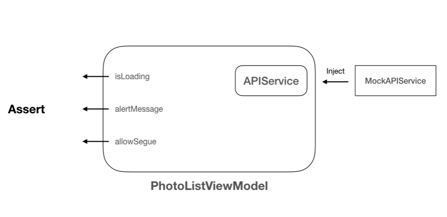

# Applying Unit Tests to MVVM with Swift

[Applying Unit Tests to MVVM with Swift](https://medium.com/flawless-app-stories/applying-unit-tests-to-mvvm-with-swift-ba5a79df8a18)

Relationship between the `PhotoListViewModel` and its dependency:

# MVVMPhotoGallery
